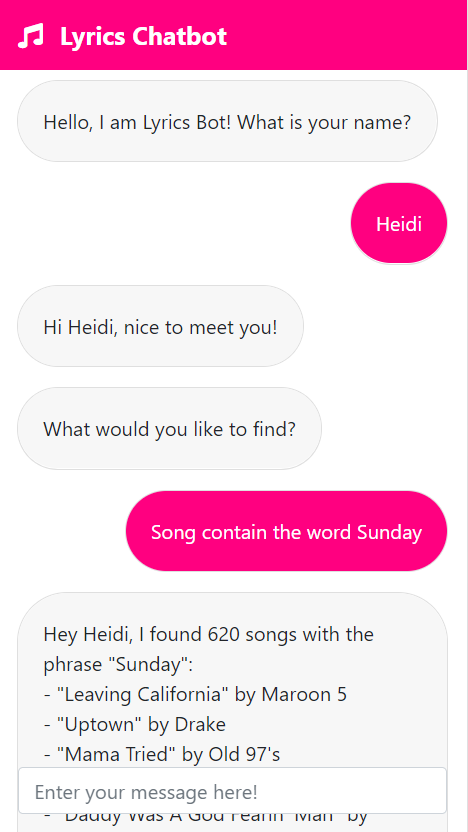

# **Lyrics Bot**

  

## **Table of Contents**

* [Introduction](#introduction)
* [Learning Objectives](#learning-objectives)
* [How it Works](#how-it-works)
* [Technologies](#technologies)

## **Introduction**

The Lyrics Chatbot is a rule-based chatbot capable of recommending random songs, finding songs by a particular artist, and finding songs containing a particular word or phrase in the lyrics.

## **Learning Objectives**

The objective of this project was to explore the concept of rule-based chatbots. Rule-based chatbots converse with the user by using regular expressions to map user input to a purpose or category, which is known as an *intent*. Once the user's intent has been identified, the chatbot parses the user input and extracts data, known as *entities*, to be used to process the user's request and return a response.

Besides building a chatbot, we also learned a lot about responsive web design by trying to make the web app look good on different screen sizes. To do this, we made use of Bootstrap's out-of-the-box responsive components. The web app's phone view is shown below. In the end, we think it turned out quite nicely.

  

## **How it Works**

The Lyrics Bot works by receiving POST requests with the user's message via AJAX requests from the web app. The sent data (which is the user's message) is then mapped to one of several intents using regular expressions. Once the intent has been identified, specific regular expression groups are sent as entities (e.g. artist name, word/phrase to match) to functions that will look through Pandas dataframes for matching rows to return. This data is finally sent in JSON format to be consumed by front-end JavaScript code.

## **Technologies**

### **Front-end Technologies**

* HTML
* CSS
* JavaScript
* Bootstrap

### **Back-end Technologies**

* Python
* Flask
* Pandas

### **Deployment**

* Heroku
* GUnicorn